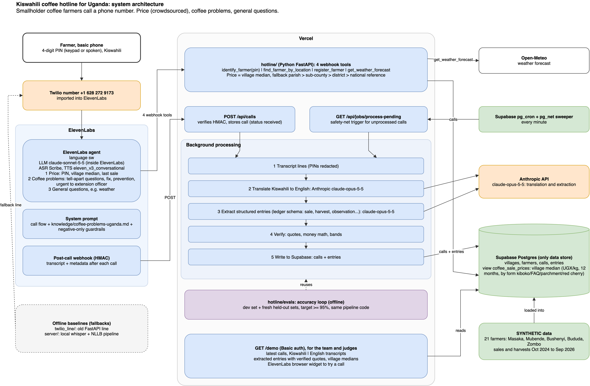

# Hack-Nation: World Bank Agriculture Case

Our team's project for the Hack Nation hackathon (3 October 2026), working on the World Bank agriculture case.

## What this is

A **Kiswahili phone hotline for smallholder coffee farmers in Uganda**. The setting is decided: Uganda, Kiswahili. A farmer calls **+1 628 272 9173** from a basic phone and talks to a voice agent. It covers two use cases plus general questions:

1. **Price (crowdsourced).** The caller identifies with a 4-digit PIN (keypad or spoken). The PIN is assigned on the first call and tied to a location: Region > District > Sub-county > Parish > Village. A caller who forgot the PIN gives first name, district and village. The agent tells them the village median coffee price (UGX/kg, last 12 months, by form: kiboko, FAQ, parchment, red cherry), then asks for their last sale (price, kg, form, date, buyer). Each answer feeds the next caller's median.
2. **Coffee problems.** The agent asks about yield problems, asks tell-apart questions from a short list of Uganda's most common coffee problems, and gives the likely problem with a fix and prevention. Top 5: coffee wilt, black coffee twig borer, leaf rust, red blister/brown eye spot, coffee berry disease. Also non-disease causes: soil fertility/fertilizer, drought, waterlogging, old unpruned trees, weeds, poor harvest practice. Urgent cases go to the extension officer.
3. **General coffee questions**, e.g. the weather forecast (Open-Meteo).

Architecture diagram: [`docs/architecture.drawio`](docs/architecture.drawio) (editable), [`docs/architecture.drawio.png`](docs/architecture.drawio.png).



## Architecture

```
Farmer basic phone -> Twilio +1 628 272 9173 (imported into ElevenLabs)
  -> ElevenLabs agent: language sw, LLM claude-sonnet-5-5 (inside ElevenLabs),
     Scribe ASR, eleven_v3_conversational TTS,
     system prompt = call flow + knowledge/coffee-problems-uganda.md + negative-only guardrails
  -> 4 webhook tools -> Vercel hotline/ (Python FastAPI):
     identify_farmer(pin), find_farmer_by_location, register_farmer, get_weather_forecast
     (read Supabase: villages, farmers, view coffee_sale_prices -> village median,
      fallback parish > sub-county > district > national reference;
      get_weather_forecast -> Open-Meteo)

After the call:
  ElevenLabs post-call webhook (HMAC) -> Vercel POST /api/calls (stores the call, status received)
    -> background processing:
       1. transcript lines (PINs redacted)
       2. translate Kiswahili to English (Anthropic claude-opus-5-5)
       3. extract structured entries (ledger schema: sale, harvest, observation...) (claude-opus-5-5)
       4. verify (quotes, money math, bands)
       5. write to Supabase `calls` + `entries` (these feed the next caller's village median)
  Safety net: Supabase pg_cron + pg_net calls /api/jobs/process-pending every minute.

Vercel GET /demo (Basic auth): latest calls, Kiswahili | English transcripts, extracted entries
  with verified quotes, village medians, and an ElevenLabs browser widget to try a call.
```

- **Evals:** `hotline/evals` is the accuracy loop (dev set + fresh held-out sets, target >= 95%). It uses the same pipeline code as the live processing.
- **Fallbacks:** `twilio_line/` (old FastAPI line) and the local whisper/NLLB pipeline in `server/` are offline baselines.
- **Synthetic data:** 21 SYNTHETIC farmers in Masaka, Mubende, Bushenyi, Bududa and Zombo, with sales and harvests from Oct 2024 to Sep 2026, loaded into Supabase and labelled SYNTHETIC.

## Folders

| Folder | What it holds |
|---|---|
| `hotline/` | the Vercel app (Python FastAPI): webhook tools, `POST /api/calls`, background pipeline, `/api/jobs/process-pending`, `/demo`, `evals/` |
| `server/` | offline pipeline (local whisper/NLLB) and the synthetic data |
| `twilio_line/` | fallback: our own Twilio webhook (old FastAPI line) |
| `supabase/` | database migrations |
| `data/` | coffee problem reference |
| `knowledge/` | knowledge given to the agent (`coffee-problems-uganda.md`) |
| `docs/` | architecture diagram |
| `skills/` | team skills (draw.io, issue workflow) |

## Shared services

Keys live in `.env`, which is never committed. Copy `.env.example` to `.env` and ask Jonathan for the values.

| Service | What it's for | Owner |
|---|---|---|
| Supabase | the only data store: `villages`, `farmers`, `calls`, `entries`, the `coffee_sale_prices` view, plus the pg_cron + pg_net sweeper. Project `hack-nation-farm-record` (East US, `supabase/config.toml`) | Jonathan |
| Vercel | hosts `hotline/`: the webhook tools, the call-saving API and the `/demo` page. Project linked to this repo | Jonathan |
| ElevenLabs | the call agent (language sw, LLM claude-sonnet-5-5 billed through the ElevenLabs key, Scribe ASR, eleven_v3_conversational TTS) and the post-call webhook | Jonathan |
| Twilio | the phone number **+1 628 272 9173** (voice + SMS, paid account), imported into ElevenLabs | Jonathan |
| Anthropic | direct API (claude-opus-5-5) for translating Kiswahili to English and extracting structured entries after the call. Not needed for the agent's LLM inside ElevenLabs | Jonathan |
| Open-Meteo | weather forecast for `get_weather_forecast` (no key) | n/a |

### Where the data lives

Everything is in Supabase, the only data store. Only server code (Vercel functions) uses the service-role key; the browser never gets it. Transcripts have PINs redacted before processing. Callers' voices and transcripts pass through ElevenLabs, Anthropic (translation and extraction) and Supabase. The demo uses synthetic farmers only, labelled SYNTHETIC.

### Keys

| Variable | Service | Where it's used |
|---|---|---|
| `SUPABASE_URL`, `SUPABASE_ANON_KEY`, `SUPABASE_PUBLISHABLE_KEY`, `NEXT_PUBLIC_SUPABASE_*` | Supabase | browser-safe (row-level security applies) |
| `SUPABASE_SECRET_KEY`, `SUPABASE_SERVICE_ROLE_KEY`, `DATABASE_URL`, `SUPABASE_DB_PASSWORD` | Supabase | server only |
| `ELEVENLABS_API_KEY`, `ELEVENLABS_AGENT_ID`, `ELEVENLABS_WEBHOOK_SECRET` | ElevenLabs | server only |
| `ANTHROPIC_API_KEY`, `ANTHROPIC_MODEL` | Anthropic | server only; translation and extraction (Opus 5.5) |
| `TWILIO_ACCOUNT_SID`, `TWILIO_AUTH_TOKEN`, `TWILIO_PHONE_NUMBER` | Twilio | server only (also pasted into ElevenLabs to import the number) |

Every server-only key also goes into the Vercel project settings (Production + Preview), so the deployed API can use it.

### Twilio

- Env vars: `TWILIO_ACCOUNT_SID`, `TWILIO_AUTH_TOKEN`, `TWILIO_PHONE_NUMBER`.
- Call route: basic phone -> Twilio number -> ElevenLabs agent. ElevenLabs sets the number's webhooks itself when the number is imported. Fallback: our webhook in `twilio_line/` on Vercel. The old route through ngrok to a laptop is only for local testing.
- The account was upgraded from the free trial on 4 Oct: any phone can call the number, and the number can call out.
