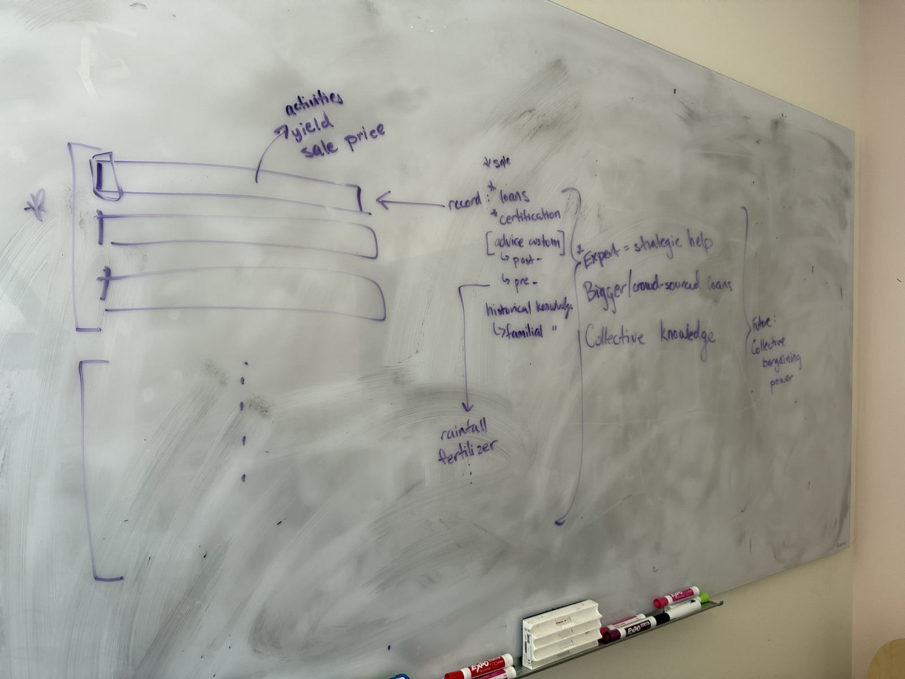

# Brainstorm transcript

Team brainstorm for the Hack Nation × World Bank agriculture case.

- **Source:** Notion AI meeting notes on the team's Hack Nation page: https://app.notion.com/p/dryftteam/Hack-Nation-3ee2073003ce80468657e08de8ba7ae3 (current meeting: "Meeting @Today")
- **Last synced:** 2026-10-03 18:43 UTC (Notion page last edited 18:42 UTC)
- **To update:** ask Claude to "sync the transcript". It pulls the latest from Notion, replaces the raw transcript below and updates the summary sections.

The transcript is automatic speech-to-text, so expect errors. For example, "Cloud Code" / "Cloud MD" mean Claude Code / CLAUDE.md, "a disease on their blood" probably means on their plant or leaf, "World Health" probably means World Bank, "metamans" / "mill man" mean middlemen, "kiamas" means chamas and "eight CCOs" probably means SACCOs.

---

## Key points so far

Summary of the raw transcript. Not verbatim.

### The idea (recap from the meeting)
Create a **record for each farmer** of what they do and see on their farm, captured by voice. Noor comes back from the field and calls a number or leaves a voice note. Over time this builds a record for her and a dataset across all farmers.

### Why voice, and why AI
- **Voice:** local language; it may be late at night with no electricity to look at a screen; older farmers may not be able to type. Talking is the easiest.
- **Why AI and not a spreadsheet or Google:** turning speech in a local language into structured records. The team sees this as the easy justification.

### What the record is for
**For Noor (individual record)**
- **Loans:** a lender won't trust a farmer they've never met without records of the field and yields. Farmers without a credit history get bad loans or none. The team rated this "super, super important".
- **Certification:** organic, Fair Trade and Rainforest Alliance need written records of inputs and practices, and certified coffee sells at a premium.
- **Farm memory:** what seeds she planted, what worked, how she treated the soil five years ago.
- **Succession:** her daughter will probably take over the farm, and today there's no diary, "it's just vibes".
- **Custom advice:** after a problem ("my crops are bad, what happened?") and before planting (weather, fertiliser patterns).

**For everyone together (collective record)**
- **Smarter expert visits:** the expert who comes twice a year can prioritise. For example, if three farmers in region 1 report the same issue, go to region 1 first. Concern raised: farmers are remote, so a visit may still come late. Region-level priorities help with that.
- **Registry:** farmers become known, so they can reach government services and loans. The brief's example: a registry reached 150,000 farmers.
- **Group loans:** lend to all farmers of a region at once, which gives them bargaining power.
- **Collective knowledge:** what works and what doesn't across farms. "Is it just me?": if everyone's yield dropped, it may be climate; if only mine did, it may be my practices (planting day, too much shade).

### What the team is most sold on
**Loans, (government) services, certification and better-targeted expert support** are the main problems we help solve. Two teammates agreed loans and certification are especially important in emerging markets.

### Day-one value: advice
- Generic advice is a "trap": farmers can Google it, and most other teams will build it.
- But it's the **carrot** that makes a farmer call on day one, before the record is worth anything.
- **Decision:** don't spend more time on it now. Build it near the end, once the data pipeline works.

### Debated but not pursued
- **Selling the data** to large firms (e.g. commodity futures): valuable, but the World Bank is unlikely to welcome it.
- **Cutting out the middleman / pricing power:** the list alone doesn't give pricing power; the cooperative does. Kept as a side thought.
- **Yield drop and climate change:** needs more research (TBD). The team still wants to give input that helps farmers grow more, e.g. different planting methods.

### Risk raised: data security
If buyers could see the dataset, they could undercut farmers with bad yields. **Middlemen and buyers must not get access.** The cooperative can, possibly anonymised, for the collective good. Expect judges to ask about this.

### Tech: the hardest part
Ingesting voice in a local language and turning it into structured data (a "data frame"). The brief lists language resources for this, such as Meta's speech models (1,000+ languages) and NLLB-200 translation (200 languages).

### Channel: decided
Farmers like Noor don't have their own smartphone, so the only options are **calls or SMS**. Sending audio over 3G costs data money; **a voicemail (calling a number) is fine**. So Noor calls a number and leaves a voice message.

### Farmers without their own phone
Some households share one phone across five houses, or have none. Idea: on a borrowed phone, **call the number and enter a personal PIN or say your name**, so anyone can add to their own record without owning a phone. The team liked this. It means records must be stored centrally, not on the phone.

### Where the data lives: open
Options discussed:
- A box on site in each village or farm (on-premise).
- Store on the device, then transfer when a visitor comes by, like a maintenance worker who collects machine data on their phone and uploads it back at the office.
- A hosted server that the voicemails go to.

One teammate said individual devices will break, so the data should sit somewhere decentralised. Another noted the PIN idea needs a central store. For the demo, the team wants something visible, like a laptop acting as the server, so judges see "there's a product".

### For loans, the record needs sales and payments too
- Lenders care most about **what you sold, for how much, and what you were paid**. Farm activities alone aren't a credit history.
- So the record should have **more layers**: farm activities plus sales and payments.
- The hard part: many farmers are paid **in cash** and have no bank account. Some use e-wallets (GCash was given as an example).
- *Claude's note:* the brief says Noor already uses **mobile money**. With her consent, her payment history is a digital record that already exists.

### Can the record be trusted?
- Concern: a farmer could simply say or write false numbers.
- **Verification idea:** buyers often hand over paper receipts. Noor keeps them, and the expert photographs them on the twice-yearly visit to check them against what she said in her voice notes.
- Counterpoint: buyers' own record-keeping in a village isn't reliable either. Sales can be tense cash deals, sometimes not safe.
- **Strongest answer:** with a big record across the whole region, **outliers are easy to spot**. If one farm's numbers don't fit its neighbours', they stand out.
- That regional view also matters for lenders: they need to judge how likely a farm's crop is to turn a profit and pay the loan back.
- Some lenders are also the buyer: they lend inputs and buy the harvest, which cuts out middlemen.

### Another use: selling land
A record of how fertile the land has been over the years helps a farmer **negotiate a better price when selling her land**. Without one, a buyer can't tell good soil from sand.

### Geotagging
Mentioned briefly: with a geotagged location for each farm, this data is easy to get. *Claude's reading:* a farm location lets us attach rainfall, temperature and soil data by coordinates (NASA POWER, CHIRPS and iSDAsoil, all listed in the brief) without the farmer reporting it.

### Concern: too many use cases
A teammate worried that a voice diary alone won't solve the problem, and that the idea now has too many use cases.

### Credit data when there's no payslip
- Lenders in emerging markets normally want payslips. Farmers who aren't employed don't have them, so some lenders use other records, such as **phone bill payments**. Buying airtime daily in small packages instead of monthly suggests tight cash flow.
- The team can't capture that data. For loans, the most credible sources remain **how much a farmer sells and how well the region is doing**.
- Concern raised: none of this can be verified without paper records.

### How smallholders borrow today
- **"5-6" lending (from a teammate's experience):** borrow $5 on Monday, pay back $6 at the end of the week, about 20% interest per week. Lenders are individuals from the village, and they collect by intimidation.
- **Other examples from the meeting:** **savings groups** such as chamas (villagers pool money and lend to each other), **cooperative advances** before the harvest, and **SACCOs** (savings and credit cooperatives).
- Next step from the meeting: check how other startups do it (see the research section below).

### Some countries already have a farmer registry
In the meeting: in at least one country, farmers registered through local officers receive an **e-voucher on their phone** to collect subsidised fertiliser, so a national registry exists there. So "we create the registry" only holds where none exists, as in the brief's fictional Ondera. Where one exists, our record plugs into it instead. To verify (see "To check").

---

## Whiteboard

Transcribed by Claude; ⭐ marks items starred on the board.

**Left: the record as a table.** One block of rows per farmer, with more farmers below ("⋮"). Each row holds:
- activities
- yield
- sale price

**Middle: what the individual record is for**
- ⭐ (land) sale
- ⭐ loans
- ⭐ certification
- [custom advice]
  - post- (after a problem)
  - pre- (before planting), using **rainfall** and **fertilizer** data
- historical knowledge
  - familial (handed down in the family)

**Right: what the collective record is for**
- ⭐ Expert = strategic help
- Bigger / crowd-sourced loans
- Collective knowledge

**Far right, future:** collective bargaining power.

**What this settles:** a record row is *activities, yield, sale price*. The starred priorities are **land sale, loans, certification and the expert's strategic help**. Custom advice is shown in brackets as a side feature, which matches the meeting's "build it last".

---

## Research: how others lend to smallholder farmers

Compiled by Claude from web sources on 2026-10-03.

| Model | Example | What they base the loan on | How it's repaid |
|---|---|---|---|
| Farmer self-tracking + score | **FarmDrive** (founded 2014) | Farmers log revenues and expenses by SMS/USSD on basic phones, combined with satellite, soil, weather and phone data | Via mobile phone |
| Field data + satellite + ML | **Apollo Agriculture** | Field officers collect farm data in an app, a verification team checks it, then ML adds satellite yield estimates and credit bureau data | Inputs on credit, automated decisions |
| Buyer payment history | **Safaricom DigiFarm** | Repayment history plus **payment history from the factory/buyer**; limit up to 100% of average earnings | Deducted from produce sales before the farmer is paid, or via mobile money |
| Cooperative delivery records | **Coffee Cherry Advance Revolving Fund** (government fund) | Cooperative membership + coffee cherry delivered (advance of 40% of the expected price, or a fixed amount per kg) | Deducted when the coffee is sold |
| Group liability | **One Acre Fund** | Farmers in groups are jointly liable; inputs only | Flexible instalments before season end; ~99% repaid |
| Lend + buy the harvest | **Babban Gona, ThriveAgric** | Inputs, training and credit as one package | Repaid from the harvest they buy (offtake) |
| Lend to the cooperative | **Root Capital** | The cooperative's future sales contracts with buyers act as collateral | The cooperative repays from export sales |

**What this means for our idea**
- **FarmDrive is our closest precedent:** farmers recording their own farm finances on basic phones to build a credit history. Our twist: **voice in the farmer's local language**, for farmers who can't or won't type.
- **Nobody trusts self-reported data alone.** Every lender anchors it to something verifiable: buyer or cooperative payment records, field officer checks, satellite data or group liability. We should show at least one anchor, e.g. regional outlier checks or the expert's receipt photos.
- **Repayment is usually taken from the harvest sale.** That's why lenders want sales records, which matches the "sale price" column on our whiteboard.
- **Gap in Noor's case:** the brief says she sells her parchment "to whichever middleman drives up the valley", so the cooperative has no record of her sales. Her voice record fills exactly that gap.
- **We don't need to build a lender.** We build the record, and with Noor's consent it feeds existing lenders and funds like these. For the demo, a one-page "season summary for a lender" (activities, yield, sales, how it compares with the region) would be a concrete output.

Sources: [GSMA on Apollo Agriculture](https://www.gsma.com/solutions-and-impact/connectivity-for-good/mobile-for-development/blog/ai-driven-smallholder-farmer-lending-in-africa-insights-from-apollo-agriculture/) · [FarmDrive (Capital FM)](https://www.capitalfm.co.ke/business/2017/02/safaricom-spark-fund-backs-agricultural-analytics-startup/) · [FarmDrive (UN Africa Renewal)](https://africarenewal.un.org/en/magazine/linking-smallholder-farmers-banks) · [DigiFarm FAQ (Safaricom)](https://www.safaricom.co.ke/media-center-landing/frequently-asked-questions/access-bank-farmer-cash-credit-strategy) · [Coffee Cherry Fund (Business Daily)](https://www.businessdailyafrica.com/bd/markets/commodities/coffee-cherry-fund-advances-to-farmers-hit-sh6-7-bn-4867766) · [Coffee cherry fund (Citizen Digital)](https://www.citizen.digital/business/coffee-cherry-fund-loans-match-farmers-earnings-312264) · [One Acre Fund (How We Made It in Africa)](https://www.howwemadeitinafrica.com/what-one-acre-fund-can-teach-us-about-supporting-african-small-scale-farmers/) · [Babban Gona (Food for Transformation)](https://www.foodfortransformation.org/results-details/babban-gonas-holistic-financing-approach.html) · [ThriveAgric (BusinessDay)](https://businessday.ng/agriculture/article/we-would-support-500000-farmers-with-56-4m-debt-funding-thriveagric/) · [Root Capital (Convergence)](https://www.blendedfinance.earth/blended-finance-funds/2020/11/16/root-capital)

---

## Use cases and problems tackled

Ordered by the team's current priority. Combines the meeting, the whiteboard, the chat with Claude and the official brief (Annex B). ⭐ = starred on the whiteboard.

| # | Use case | For whom | Pays off | Brief link |
|---|---|---|---|---|
| 1 | ⭐ **Record for loans:** field, yield, sales and payment history a lender can trust, checked against the region; group loans for a whole region | Noor, cooperative | Next season | Not named in the ag brief; best framed through the registry precondition (see "To check") |
| 2 | ⭐ **Record for certification premium:** voice notes become the input and practice records certifiers need | Noor, cooperative | Next harvest | No fair price at harvest; "connecting evidence to a pricing, market… next step" |
| 3 | **Registry:** every caller becomes a known farmer who can reach services | Cooperative, government | Ongoing | "The absence of a working farmer registry" is the binding constraint |
| 4 | ⭐ **Targeted expert support:** reports show which farmers or regions need a visit first | Extension officer | Now | Extension "staff shortages, manual data collection, delayed alerts" |
| 5 | **Collective knowledge:** what works across farms; "is it just me or the climate?" | Noor, cooperative | Weeks to years | "Yields have dropped… she cannot say why" |
| 6 | **Farm memory and succession:** a diary of what worked, handed to the next generation | Noor, her daughter | Years | Not in the brief; good human story for the video |
| 7 | **Day-one advice (the carrot):** after-problem and pre-planting advice; built last | Noor | Now | Timely, localized advice |
| 8 | ⭐ **Land sale:** proof of how fertile the land has been, for a better sale price | Noor | Years | Not in the brief |

---

## Use cases by timeframe

Claude's proposal on 2026-10-03, answering "what are the use cases, first individual, then collective, immediate / mid / long term". Not yet discussed by the team.

**Immediate** = next day to a few weeks · **Mid** = this season to the next harvest · **Long** = two years or more

### Individual: Noor

**Immediate**
- **Read-back:** after each call, a short voice reply confirms what was recorded ("You sprayed two rows on the upper plot. Correct?"). This doubles as the human check.
- **"Is it just me?":** the next day she hears whether neighbours reported the same problem, and that the extension officer knows. A web search can't tell her this, so it's a day-one reason to call that isn't generic advice.
- **Memory on demand:** "When did I last apply fertiliser?" is answered from her own record.

**Mid**
- **Season summary:** activities, harvest, and what she sold, to whom and for how much, on one page (or read out) for the cooperative or a lender.
- **Price memory:** what she was paid last time and this time, so she negotiates with the middleman with numbers.
- **Cooperative advance or input credit** based on her record and deliveries.

**Long**
- **Credit history:** two or three seasons of consistent records mean bigger, cheaper loans.
- **Certification:** organic needs about three years of records before the first certified harvest.
- **Yield diagnosis:** her yield trend compared with her neighbours' separates her practices (shade, old trees, pruning) from climate.
- **Succession and land:** a diary for her daughter; proof of land quality when she sells or leases.

### Collective: cooperative, extension officer, region

**Immediate**
- **Early warning:** several reports of the same symptom in one area in one week trigger an alert to the extension officer, plus a visit list ranked by urgency.
- **Broadcast back:** a voice message to every member in that area ("rust reported nearby, check your trees"). One farmer's report helps everyone.

**Mid**
- **Harvest forecast:** expected volume per area, so the cooperative can plan buyers, transport and pre-harvest finance.
- **Price transparency:** anonymised prices that middlemen paid this week, so members know a fair price.
- **Group certification:** Fairtrade, Rainforest Alliance and organic certify smallholders as groups, so the cooperative needs records for every member farm (an "internal control system"). Our record feeds that. Certification is therefore both an individual and a collective use.
- **Registry and group loans:** a list of active farmers with records, for services, subsidies and group lending.

**Long**
- **What works here:** which practices go with better yields across farms, giving local advice that beats generic search.
- **Climate or practice:** regional yield trends combined with rainfall and soil data by location.
- **Insurance:** area-yield index insurance needs years of yield data per area.
- **Bargaining power** (the whiteboard's "future"), and **local-language voice data**, used only with consent, to improve speech AI for that language. This ties into the "localizing AI" question.

### How to make the record more useful
1. **Give something back on every call** (read-back plus one useful line). Otherwise farmers stop logging and the long-term uses never arrive.
2. **Record numbers, not just stories:** date, plot, quantity, price, buyer type and payment method. Loans, certification and forecasts all need numbers.
3. **Tie each record to a place** (plot or geotag), so weather and soil data attach automatically.
4. **Anchor it to something verifiable:** cooperative delivery records, mobile money with consent, receipt photos at expert visits, and regional outlier checks.
5. **Show one record in several views:** voice for Noor, a list or map for the cooperative, a one-page summary for a lender and a practice log for certifiers. Noor decides who sees what.

**For the pitch:** the immediate collective uses (alerts, "is it just me?") keep Noor calling. The long-term individual uses (loans, certification, land) make the record valuable. One needs the other.

---

## Still open

**Decided: the channel is a phone call with a voicemail**
The brief says Noor's own phone is used for "calls, messages, and mobile money" (a basic phone), and her daughter's smartphone is only around on weekends. Voice calls work on any phone and use no mobile data. The meeting confirmed: calls or SMS only, and voicemail is fine.

**Decide now (blocks the build)**
- **Setting: no country named for now.** The brief uses the fictional Ondera highlands and Ondera Coffee Cooperative; the notes stay country-neutral until the team decides.
0. **Where the data lives.** Claude's suggestion, which reconciles the two views: **one small server per cooperative** (e.g. a laptop at the cooperative office). It's decentralised across cooperatives and central within one. The PIN idea works within each cooperative, the data stays with the cooperative rather than a foreign cloud, and the laptop is the visible "product" for the demo. Calls still need a phone line or provider that forwards voicemails to that laptop.
0b. **Identifying callers on shared phones:** a PIN, saying your name, or the caller's number by default?
1. **The brief's "one better agricultural decision".** Loans and certification are outcomes, not farm decisions. Frame the tool as "documenting a field observation" and "connecting evidence to a pricing, market or extension-service next step", which is the brief's own wording.
2. **What one record contains:** the whiteboard sets the core as **activities, yield, sale price** per row, one block of rows per farmer. Still to detail: date, plot, inputs used, observations, and how she was paid (cash, mobile money). This is the "data frame" and drives the whole build.
2b. **How records become trustworthy:** regional outlier checks, the expert photographing paper receipts on visits, and mobile money history with consent. Pick which to show in the demo; outlier checks are the easiest to build.
3. **Who sees what:** Noor owns her record; the cooperative sees it, possibly anonymised; lenders or certifiers only with her consent; buyers and middlemen never.
4. **Leaf photo checker:** the meeting didn't mention it. Drop it?

**Decide during the build**
5. **Daily incentive:** if Noor reports daily, what does she get back each time?
6. **Speech-to-text for the local language, then extraction into fixed fields** from a fixed list, so nothing is invented.
7. **Human check of each record:** e.g. read the extracted record back to Noor to confirm, as a guardrail.
8. **Where the AI runs** (cooperative laptop vs cloud) and model size, for the "offline" and "small model" rules.
9. **A less-supported language:** what happens there? The brief says to expect this question.

**To check (facts we're relying on)**
10. **The brief's registry example:** it says a working farmer registry "unlocked advisory services, insurance, and grants for 150,000 farmers". It doesn't say loans, so quote it as written.
11. Which records each certification really requires, and whether voice-based logs would be accepted.
12. Whether lenders would accept these records. See "Research: how others lend to smallholder farmers" above.
13. Problem evidence with source, year and country: FAOSTAT coffee yields, extension officers per farmer (once we pick a country), certification premiums, smallholder access to credit.
14. Test data without real farmer recordings: synthetic voice notes, clearly labelled as synthetic.
15. **Which countries already have a working farmer registry** (e.g. the fertiliser e-voucher registry mentioned in the meeting)? This matters once the team picks a country: there, use case #3 becomes "feed the existing registry" instead of "create one".

---

## Raw transcript

I already invited you to a chat, get rapport. Do you also have GitHub or Cloud Code? Wait. That meant right here.

Can you type in your email or username? Thank you. Can you also type in your username? Yes. So normally it's like the URL, like that, and that's that. Yeah, I think that's just my first name.

Sorry to interrupt you, but what is the outcome from But then, like, it has all this information, but what is it trying to do? Yeah, that's a great question.

I'm also about progress with Dargill. Thank you.

Coffee yield decline, right? The question is why did it happen, how do I fix it? There's no, right now if I'm in the position of a farmer, I've done my best, right? Maybe I've talked to people in my village, figured out, what are you planting, what does the weather look like? Maybe I Google searched on my daughter's phone, figure out, is today a good day, is it raining tomorrow? Then when the coffee yield shows up and it's not great, Do other people have this problem? Is it my fault? Did I do something differently? Was there anything I could have done to prevent it? How do I prevent it next time?

And I think the thing with something like this is having this massive record could be helpful for just being able to pinpoint some of those issues and then prevent them in the future. So if you think about things like really simple, like trees that are providing too much shade to your plants because they're not getting enough sunlight, so your yield is bad. You're not going to know that by a picture of the leaf.

You're going to know that by somebody who's really, enforcing this model, it's like, hey, we planted this tree, or we cut down this tree, or now we have a lot of clouds today, that's something like that, we're able to have this record, so it's more of just this record keeping for them, but we can think a lot about what the specific outcome is that they currently can't have right now from a Google search perspective.

That's the number one issue that we need to find out what it is, so yeah.

Exactly.

But it's like more than like a long-term solution or they can also like let's say um the plants have some diseases they can also say it on the phone and maybe the day after they get like a response on what they should actually do.

We have an open source thing here.

Maybe being... Have you done both?

Okay So we want to then focus on short-term, unlike more on the long-term.

I think.

Isn't alter more important though? 'Cause like, I mean, it's--Yeah. Yeah.

But probably it's always a mix, like also for the long term you still want to get feedback on the weather and a lot of those things. I think it's always a mix. I get like long term, we can say yeah we start short term, but long term the record will be more and more valuable. And we kind of incentivize that the people do it also daily. So if they do it daily, they also get something back, something more in dot angle.

So with time we build up the huge, huge record and then after like one or two years it will be like super, super powerful. We still need to give them results now. Obviously if they have a disease on their blood, I think that's the most urgent one. We need to give them feedback on the disease. We can't say, "Okay, you need to build up the record." You're right.

You're right. You're both, right? The short term is the long term. I don't think is the one thingI think the one thing we choose is what's happening in the short term and what's happening in the long term, that's one thing, but you do need both. So I think we put them together. The question we now have to answer is, So in the prompt, it said-identify a solution for documenting field observation. So this is a mechanism that we've now talked about. What is the output of the field observation? Is that what we just need to solve next? And then we can start really thinking about implementation.

So maybe we do like 10 minutes of just like brainstorming and then we're back.

So if you interpret what you said, you just take the outcome of what I said, right?

It was a little bit like... To answer your exam question, like, okay, we have this idea, voicemail, whatever, to create this record, what does that do? How does that help us?

Interesting. Anything that has to be labeled as fair trade, organic, or rainforest alliance, all require written input records. So if, and obviously you can charge a premium for something like that, so we're thinking about pricing and our ability to make more money based on our crops. Having this recorded, record of how she planted everything and the practices that she used in order to make the crops go to the shade.

One example of an output of why you would want to keep it like this. Just maybe.

So from what I understand, like super dumb terms, as much as maximums are profit. Yeah.

Another potential output for something like this is if everOne is speaking, you know,A one minute voicemail into your phone.

Mm-hmm. Mm-hmm.

One person who comes at max twice a year. Yeah. If you don't want to land, yeah.

Okay, let's... Put all together How do we want to map it out? So first we know what the tool that we now build. And now like the use cases for each of the programs, right? Okay. Yeah, you can start. I mean, you already mentioned something. I directly throw it in our Cloud MD. So type it in there. So that's it. You want me to talk about what I'm thinking? Yeah, sure, go for it. I'll be off, also on Notion, cool.

Okay, so I think the idea is to recap is like how can we create records for individual farmers to be able to track what their processes have been on a daily basis. As we think about this, Side effect, you also have more registered farmers because it was also one problem.

More farmers were on record because one problem was that reach outdoor farmers and that would be like a side effect.

100%. Can you repeat? 40 minutes.

Like not only would this be valuable just for you as an individual farmer, but now as we think about the World Bank which sponsors registries, if all three of us fill it out and we're all the farmers in some country, now they have all of the farmers in one data center.

Those are my points here.

The reason we would wanna potentially consider voice for something like this is because it's like local language, you got farmers, I don't know what like, and functionality is available late at night. Electricity might not be available if you're trying to see something on your phone. These are the older people that might not be able to, I don't know, type. So I feel like talking is probably the easiest.

Or literally, trying to find your type of--Everyone, that's a classical to everyone. um Why this would be AI and not something that's like a spreadsheet, Google search, whatever, is because of the voice translation. So that feels like an easy justification for us. And then as we think about where this is valuable, a couple things. So one, what I was mentioning, certification. So if you want to certify it, organic, fair trade, whatever, you need to have records of what you did and how you planted your crops.

So that's one option. Other ones, if you want to go alone, you need to be able to have records of what your field was like,How it went every year is that I trust you as a farmer and said, "You're just coming to me "and I've never met you before "and you're asking me for a million dollars, right?" I think that's also super important.

In our concept, we pitch how we do we bring it actually. Keep it.

Totally. Also for the community effect in that, okay? And the other piece here is what we got, what we were talking about with the-Expert. That comes twice a year. They're able to be more strategic about who they go to when, because he needs more help quickly. So that's why they're like so. I think there's lots of positives with something like this.

To that point, I have the exact same thing. Getting these people on the list, 'cause these people aren't known. And if they want help from World Health or whatever, they need to be honest. I just had some facts here. Like 150,000 farmers in Ukraine that didn't have, they weren't on our list for anything once they got eventualized and finally got loans, all those sort of things. And they're able to get these government services, et cetera, which is something I think, yeah, we should focus on that then.

Trying to get people help, you know what I mean? 'Cause I mean, we're literally doing it for World Health. And if we can make their job easier by helping people, Yeah, but Hmm.

One thing that comes to my mind, I mean that the yields have dropped, that probably also has some long-term issues, but also some short-term things, what you need to fix. And I think the farmers might be especially interested in the short-term fixes, because they want to have the answer now. Like, what's going on with my plants? Like, is there any disease? And of course, then it makes sense, with all the data from the whole region, then maybe we can compare, like maybe a lot of farmers have the same issues.

A lot of those things. Hmm. What are the main problems that we tackle in our challenge? I get all these side effects, but do we also tackle the challenge that the yields have dropped and how do we tackle it?

So the yields dropping might not be a problem in reality, right? Like if my yields drop from 100 to 90 in one year, but everyone else's also dropped, then maybe that's just climate change. Right, like there's nothing that we can do about that just for me. There are questions about what you can do with that low yield if it's my fault, right? Maybe I planted on a bad day, the weather was bad, I'm shading my crops too much, something like that.

So there's like,TBD.

okay we still need to do more research on that oneWhat you just said. Specifically about what though?

The climate change.

Yeah, the climate change. Yeah. Specifically, they never talked to the people about this. You know what I mean? It's more valuable to have a phone system to talk to other people about this. That's what the whole point was here, in the file at least.

But still we kind of need to fix the issue that they can grow more. For example, I know in Africa there's some concept that you planted in a different way, a lot of those things. So I think still we need to give input on that angle.

Yeah. The tricky part of giving input, though, is you can find out... search, right? For some times. Oh, okay, like what's happened to my crop? My leaves are turning yellow. Like maybe you don't need AI for that. And so we're trying to figure out where the AI is, but I agree with you. It's like you need that, and then you also need the carrot, right? Why would a farmer come to you on day one if they can just go to Google?

Hopefully you're providing something meaningful to them. So maybe that's our customer acquisition strategy is to be able to provide the free advice or customized advice. But then as we submit this and we're talking to the world, well, we can just Google search. Well, that's not the whole point. Yes. A benefit, right? That we're helping them with? But they can Google it too. And the piece that's risky here, just something to keep in mind, 'cause we're hoping, if we become a finalist, we'll ask this, it's just like, what about data security rate?

If all of us have really bad yields, or I only have a really bad yield, and the buyers have access to now this big data set, they can undercut me in a way that they couldn't before because they didn't have the visibility. That makes sense.

That means we need to cut out the metamans.

Not cut-off more lines, but make sure they just don't have access to the data. Like the co-op can have access, but maybe that is still anonymized, so you don't actually know who it is, but they use it for the collective good. We can talk about that down the line, which is something that's going on. Thank you. Do you like this idea? Yes. Where do you guys see problems? Or any sort of questions that we should dig into.

I'm just curious about how this will work. The final outcome, I still am not quite understanding. Is it just to get them on this list like you're saying?

Yeah, yeah, maybe it's a good word. There's a lot of benefit, but it's hard to see because it's It's a very rudimentary product, right? We're just making a list. Okay, so this is one row. And then ultimately we're creating this like Really long data set, right? There's a ton of benefits here. So at the micro level, what are our benefits? What are we talking about? You now have a record for things like loans.

Mm-hmm. I see the loan record is super, super valuable.

You also now have a record for certifications. So certified organic examples that you can increase your sales. Now, if we think about it not just from an individual record standpoint, but from a broader collection, what do you have?

I don't think I'm gonna say monster. I'm not gonna lie to you.

Yeah, okay. So you have collective knowledge, right, about what's happening. So there's like live, well, okay, here. Let's do that more obvious one first. Is that person, what was it called?

A... Which one are you? Oh, the person. Oh, yeah. I forgot what it's called. I'm gonna call it the expert.

I'm just gonna call him the expert.

The expert, yeah.

The expert can now be like strategic. Yeah. in their support. Right, that's the first thing. So the people who actually need help first.

Then with the farmer's list.

Yeah, the whole list. So now if we think about loans, we can do like a bigger loan.

This extra person only comes twice a year, you know what I mean?

Exactly, but they have no idea who to go to when.

Wouldn't it be too late anyway if they came like two years later or whatever?

They come twice a year.

Okay, twice a year. But wouldn't it still be too late? Normally, yeah.

Because imagine you're just like, close your eyes and you're like, I'm going to pick somebody to go to today. Versus if I have something that can anonymize the data or maybe it doesn't need to be super anonymized for the expert, but it tells them like, you should go to this person tomorrow. Okay.

The question is still though if they don't come because they're so remote to farmers, that could also be an issue. Because I think they just can't like hand back to which farmer they go.

I agree. They could however do, if this is a co-op, like this is region one. And then three people or two people, three have said they've seen like an issue. Then it's like okay, prioritize this region.

Something.

Okay, so strategic support from the expert. There is this idea of like crowdsourced loans. So if we now have a collective herd of all the farmers in this region, then you can make a loan to all the farmers at once, so there's the sparking power that comes from the worker keeping?

Yeah, also individual. Yes. What else comes from? A huge record.

of farmers. That's just valuable in and of itself, no? What did you say? It's just valuable in itself.

Well, why? It's just a list.

No, like for example, if I could, no, that's a dumb idea.

No, no, say it.

I'm just saying these data sets could be like immensely valuable for like huge firms. Like do you like future stuff on this stuff? Like I remember like when I was learning all the quant stuff, like they just do like futures for like wheat in Brazil or whatever.

You know what I mean? Yeah, yeah, no, that's fair. This is true, there's a lot of value in data like that. I don't think the world would think we would be super receptive to selling it to like a big brand.

But I agree with you.

There's like other monetary upside. Yeah. Okay, there's more here. I'm just forgetting now.

I mean one huge is probably that you can improve from the collected farmer that they can grow more because you have all the data. And obviously then you can see balance. What is working, what is not working, what are actually problems. Collecting knowledge.

I'm thinking more on the tech side. Sorry. I'm just thinking more on the tech side. I'm thinking about feasibility. Okay.

Yeah, let's get there.

Yeah, I know, I'm a little bit ahead of my player.

No, no, no, you're fine. Let's just make sure we're bought into this.

Yeah, yeah, I think that's important that we know what to build. Yeah. Sir, I'll look.

There's no place to lie. Um...

Hmm. Okay, so individual record, you're able to better apply for loans, better apply for certification. You can get individual, like custom advice, but I feel like this is kind of a trap. Because you can find advice on the internet. So this is like a sub-blog.

I agree on that. But I think it should still be brought, to be honest.

No, because every other team is going to do that. That's like what everyone's going to go for. Oh my gosh.

So this is like not our main, but it does exist.

Yeah, it does exist, or we could build it. Because obviously the farmers, like if you go 100 years back, people don't search something in the internet. You also need to have this in mind.

Well, no, like you're saying, but I mean, we can kind of just plug that feature in if we just build this whole infrastructure. Yeah, yeah.

And okay, there's two ways you can give advice. Also, post advice. Okay, my crops suck. what happened and it can tell you, but also pre-planting advice. You're about to plant this tomorrow because you told me that, but here's the weather patterns, the fertilizer patterns, blah, blah, blah. So there's two ways that could work. And then they would both be custom to your specific situation. Okay. What else is useful about creating a record?

I think like On the individual front, for future years, if you were just remembering how many seeds did you plant? Did it work? Did it not work? What happened to the soil? How did you till your soil to ensure that you've renewed the minerals? If you don't remember what you did five years ago that really worked, how are you going to ever do that in the future? So I think there's just historical knowledge.

Or even... Like one of the big benefits here, this farmer is going to die. The daughter is probably going to take over her farm. There's no diary, there's no record, it's just vibes, right? And so there's a little bit of like familial Yeah.

What else? Why would an individual record be helpful?

Obviously hyper specific advice or whatever, but aren't these people competitors?

It's a little tricky. No.

No, like, that could commune.

We don't have enough food on the planet right now to feed everyone.

Yeah, you're right.

So they're never going to, like, not make a sale. And together they're stronger because I can go like...

Sure, in practice everyone's stronger together, but I mean... Me and him are still gonna fight over the two dollars, you know what I mean? So I don't know, what-You don't have $2 to fight over though. Maybe. Like you have coffee plants, you have coffee plants.

So I don't know, what-You don't have $2 to fight over, though.

Maybe.

Like, you have coffee plants, you have coffee plants. If you work together, you can get a good price. If you don't work together, one of you is going to get a worse price than the other.

Because we underbought ourselves. You sell it for $2, I sell it for $1. And you sell it for $50, for 50 cent.

I guess they're making it public record then, like you said, okay, yes, that makes sense.

Maybe just, I think farmers, where the price of money is made, farmers mostly don't make their money, it's mostly the middlemen, because they buy it super, super cheap and then sell it super, super expensive. Some stuff, I don't say that we should do it now, but they cut out the middleman's, so it's more transparent. People saw my future on Weed.

Yeah, I think the way to do that is like-to cut out the middleman is probably somewhere around--With that, with them.

Oh, no, sorry. With the list, do we have the list? Farmers? Could have been knowledge bigger.

Like pricing power. I guess they don't, I don't think the list actually gives them pricing power. I think that's the go off.

No, but if you have all the records of all farmers, then you can definitely somehow cut out the middleman's because at the moment--You sell like wholesale. In the moment, the middlemen might have the record on the farmhouse. Just a side thought.

I don't know. Like future... Yeah, I agree with you. And I have collective gardening.

Because let's say the farmer's mill man knows this region and another region. So technically they could buy it cheaper here and more expensive wherever. Sure, sure.

Okay, so I think in this case, what I'm most sold on is loans, services, certifications and this on the ground support is more dedicated. I feel like those are like the mainProblems that we can help them solve.

Yeah, I think loans and certification, I agree. That's super, super, super important in the emerging markets. People always need loans that don't have a credit history, so they mostly get like super shitty, shitty loans or they don't get loans at all.

We're going to figure out the media value of stuff.

The immediate value of something like this Like the day one value?

Yeah.

Okay, you told me you were going to do... Yeah, this is your day one value.

Okay, yeah. We shouldn't spend a bunch more time there, I don't think.

At that day one value? Yeah, because everyone else can do that.

Totally agree.

But I think that's something we can build up quite fast.

I think we can do that near the end. That's the easiest part, once we have all the data in place.

Yeah, let's do it. I think the hardest part, well I actually don't know how to engineer a Bible, How do we actually build the piece that ingests from a different language and just collects it and puts it in a data frame? Maybe that's really it.

I feel like that's something at the heart. Maybe just the language is something. Because that's the only way to get to work is just building data layers. Like, how do you quote unquote stop for businesses?

Yeah. It's not that difficult.

Okay. Yeah. The language is part, like you said, they had some stuff here. What does it matter?

But they had a bunch, like 200 languages. Right, right. Yeah, a lot of stuff in Africa that's there. Yeah.

Okay. I want you guys to poke holes in this because it's really,If you're sitting in this woman's house, you are the woman you draw on the phone. You're out on the farm all day, come back. Just talk to the phone. Just talk to, like call a number? Yeah, call a number. And it goes to this voicemail?

But the connection's so bad anyways, I mean, you just capture that, like it's like an audio note or whatever. And then you text it? Yeah. Okay.

I don't know if it's possible with the phone.

Yeah, 'cause it's 3G or whatever. So 3G, does that transfer audio? But I want you to check real quick. Don't, yeah, yeah, yeah.

Also, what is, are there any notes about what kind of phone she has?

If you could just put a little packet, something. Sorry. Uh-uh.

I know this is kind of far in advance, but just start thinking about it. Is this gonna be like an on-premise little thing in our house or something, or is this gonna be on the middle of all the farms or something?

No, because it's hosted.

Or we're doing it on device and then when the person comes it just transfers on their stuff. That's also a solution as well. Yeah, can you dumb it down for me? OK, so for example, there are certain things like-Different machines that create quantities of something, I don't know, like they make different, like amount of flour. And we can't have that because there's no connection, Wi-Fi connection on-premise, so it can't get to the server.

So when a maintenance worker goes in, he logs in on his phone through the service, all the information is transferred onto his phone, and once he gets back to the place, it uploads onto the place. You know what I'm talking about? Or is there going to be like a server in the middle of Palo Alto here where we text it and it just stays on that local server, and then she comes back with a laptop and then it goes to her laptop or whatever?

What do you think is best? Um...

People are going to break their individual things. So I think it's decentralized somewhere.

Agreed. I also want us to think about people who don't have phones at all. We're building for this farmer who has a phone in our house, but maybe they share a phone across five houses. So on a borrowed phone, can you call a number, put in your individualized PIN code or whatever, or your name or something, so that I don't even need a phone, but I can still contribute to this public record? Yep.

That's a good idea.

I think in that case, it would need to be centralized, right? Oh, man.

I wish there were a fire or something here. I was supposed to do it on a laptop then. It was to show a server or something. The judges were like, oh, there's a product there. Is 3G concurious?

I'm more concerned if she already has a smartphone is this actually in the case? Yeah, yeah cause because we don't know if those folks actually have smartphones to send voice notes, they don't so The only option is like calls or SMS you 3G costs money to send voice mail.

Like if I'm like sending audio. Like a audio.

But a voice mail is something like that is fine?

Yeah, that's fine. Cool. Okay.

Guys, I'm pumped. That's actually a really cool project. Mm-hmm. What university are you at?

I go separate.

Geez, yeah, that makes sense.

Yeah. Yeah.

You're very good on your feet, Jace.

Oh, thank you. I appreciate that.

I'm losing it like 20% here. I'm losing the focus here sometimes. Um.

You said business? Yeah.

Cool.

I'm going to push it here one more time. Any holes. Like, this is the perfect time to, like-We got it all on tape, right?

Is it recording stuff?

Yeah, it's still recording. Let's put it here on the-yeah. It's constantly updating the MD file. Yeah. So it's connected.

Let's pull it right now and just talk to it and make sure.

Do you want to see? Yeah. Email it to us.

What do you want to do?

So just take the MD file and email it to me or something.

Can you upload it? I think it should be in GitHub. Wait, let me push it. Yeah, push it. And then you can just chat over a cloud code or whatever. Yeah, yeah. --You know what's also interesting?

Okay. If you want to sell that land, right? You need to be able to know how fertile the land has been for the last few years. And if you don't have a record, you don't know. It could be sand. It could be really fertile dirt or whatever. But this could actually help you negotiate a better sale price on your own land.

Yeah, that's true. I mean, obviously an obvious concern is just how true it is.

Touching the record, can you pinch it? Yeah. Yeah. If it is live recorded every day and it's held like that, you have to--I would work for a year to get like 100 kids to--Maybe, maybe, true.

You know what I mean?

Maybe that's what you're like, for you to know. Also for the notes, how it, More important than the Rutgers are. Well, because... Yeah, I get it for the loans, but for the loans, I think it's more important that I have, like, the end words for what I sell. So they can see the transactions of what I do.

Hello.

True, true, it can be both. I mean the record doesn't just have to be what you did on the farm.

It can also be like this is how much I sold it for, this is how much I paid you.

Yeah, maybe we need to enrich the record across more layers. 'Cause that's like the most important thing for loans. Otherwise, with just a record, of course, Because it contributes to the credit history. For example, they need to see that like a bank transfer has been done. Exactly. Something like that because they don't want invoices or maybe they even get paid in cash that could also happen. I'm so tired.

So, somehow we need to capture those things. So either they have like an e-wallet, what we need to capture, or an e-wallet. Like an invoice record or something? Yeah, like most, those folks that don't have like a bank account. For example, in the Philippines, they all use like GCash, that's like an e-wallet. Or in India or wherever, Or often they get also paid in cash.

Yeah, I think they're cash transactions.

So that's like a hard part. So what I mean is that middle guys, someone needs to give them an invoice.

Okay, maybe this is kind of dumb idea once again as well. The expert when they convert two times a year, they can keep their records because, I don't know, they give them cash, but they probably give them an invoice or something. And then we can just verify those records because they can be pulled from their individual file. This, this, this, this, this one. They just scan it in, scan it in. They can get verified. You know what I'm saying?

Yeah. Okay, so you are a farmer and you have, you get to make a cash, but they give you paper invoices. Okay, you keep those records and then when I come two years later, I take photos of those records. Twice a year. Sorry, twice a year.

And I go back and I take photos of it and then it verifies that exact amount by whatever you said inside the vault or whatever you want to call it there.

And those can be verified.

I mean, if I say I got a million dollars in the vault and I write a million dollars on a piece of paper.

No, but then it's not.

Because there's a company buying it, you know what I'm saying? Yeah. So it's always you can double-check with the company as well, because they're not just going to trust one person.

I wouldn't have so much faith in the company. record keeping for something like this. Okay. Just because we're being like super of a village, right?

Like really, like, Oh yeah.

Yeah. The corporation stuff. Yes. Yeah. Yeah. Yeah. There's all the shoes. Like you're coming in with cash.

You have a gun. Like this is not a, like maybe not the safest place. Yeah. And it's maybe not the most like calm negotiation either, right? And it's just like, this is the cash, like give me your stuff, and we're really fine. And so I really think about these. I don't think they're that tense, but they can be that tense of a negotiation. And so as we think of the sales praise, they're not going to have a good progress.

I think the voice And the yield over time is probably going to beYou're right about lying and the ability, but then maybe you use the fact that you have a huge record, right?

To be like, okay, it's pretty easy to see the outlier.

That's true. That's also important for the loans. For example, loans could be that you give them drops or whatever. Then you always need to have the likelihood that those drops actually come profit. And therefore the record is super valuable.

Well, you can just see the whole region and just see if the number makes sense.

Yeah, right. that the one farm is also paying it back. So you can give the farm a lot. So I think that's like a huge thing. And I think some of those loans for farmers, some have like the whole infrastructure also from them buying those crops, they give them the loan and then also buy the crops or like the yields or whatever. So a lot of, often that means everything is involved as well. Translates as a small heads up.

And often like the middle man's are maybe then a bit more cut out. But yeah.

What?

Yes. That's pretty good. Do you have it?

Yeah, you got it now. Thank you. What's wrong?

Is this table on? Oh yeah it is.

It's quite practical. Like it's connected in Notion, it's updating itself. It's quite cool. Bring forward the flag.

-Like if you have a geotagged location, You're able to get this pretty easily.

I'm just going to wait for the same corn pines, I've picked up some stuff from the little water we got. Okay. The nursing board. Can you talk about it, I'll do it right now.

Still a big... I just keep seeing here the voice in my diary is not going to get rid of it alone. Yeah.

Mm.

So too many use cases as well.

Just saying, Alfred. Hm. In the merchant market, information is very useful. Obviously, the traditional is like payslip and all of those things, but a lot of people are not employed or whatever, they don't have those information. Then you take other records, for example, that they pay their phone bills. And if they pay their phone bills, then you can also track, oh, are they taking like, do they pay their phone bills on a daily basis?

That means they don't have money to pay it on a monthly basis. A lot of those factors you also keep in mind and track.

They're buying like packages.

Yeah, right, right. Even something like that, like...

Like you're in a Walmart. They're buying a little package. Yeah, it's like remote. Yeah. Yeah, super remote.

Okay, that is also something we can't really try. But still though, then for loans, The most credible source is on how much they sell and how good the region is doing. to get loans. I think that's the main information.

So what is your saying that counters that?

Which, sorry, I was reading.

Like, why is it saying that? It'd be hard to.

Just because nothing can be verified.

What do you mean though?

like actual paper and records.

Can you ask it like in remote areas of Africa, how do they currently get loans? Like what rents do they have?

They don't get loans. I can only say from the Philippines people who even live in Manila, that's the capital city, they often do 5-6 landings. What it means, on Monday I give you 5 USD, on end of the week you pay me back 6 USD. So they pay around 20% interest per week. And the loans are mainly done by like individual people from the village or from the community. So basically you call me, I will bring you the money and after one week I'm going to collect you and I have like a baseball bat with me and take care that I'm going to collect it.

Okay, so villagers called kiamas in Kenya, like pool money and they lend it to each other. Co-op advances before harvest. That's eight CCOs.

Let's check how other startups are doing it.

Can you now run some subsidized fertilizer through a farm? Registry called. Yeah, it was. Farmers are described through local officers on receiving an e-voucher on their phone to collect subsidized fertilizer. She's right there, yeah. Do the Rook Street already exist in Kenya apparently?
